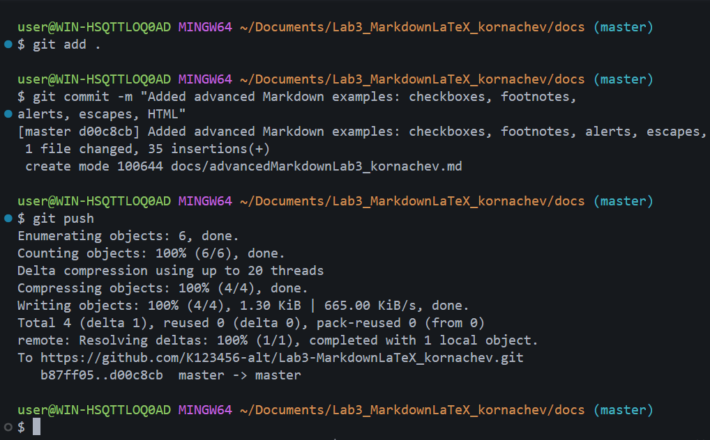

# Лабораторная работа №3. Работа с Markdown-разметкой и базовое использование LaTeX

## Краткое описание

Данный проект создан в рамках лабораторной работы №3 по дисциплине ИСРПО. Цель работы — освоить базовые возможности Markdown-разметки и научиться использовать LaTeX-формулы в документации. В ходе работы были созданы файлы с примерами заголовков, списков, таблиц, цитат, блоков кода, ссылок, изображений и математических формул.

## Содержание

- [Структура проекта](#структура-проекта)
- [Форматирование текста](#форматирование-текста)
- [Списки](#списки)
- [Цитата](#цитата)
- [Блок кода](#блок-кода)
- [Таблица](#таблица)
- [Изображение](#изображение)
- [Ссылки](#ссылки)
- [Чекбоксы](#чекбоксы)
- [Сноска](#сноска)
- [Alert-блоки](#alert-блоки)
- [LaTeX-формулы](#latex-формулы)

---

## Структура проекта

- **docs/** — Markdown-файлы с примерами
  - headersLab3_FIO.md
  - separatorsLab3_FIO.md
  - formattingLab3_FIO.md
  - listsLab3_FIO.md
  - linksImagesLab3_FIO.md
  - codeQuotesLab3_FIO.md
  - tablesLab3_FIO.md
  - advancedMarkdownLab3_FIO.md
- **img/** — скриншоты
  - gitPushLab3_FIO.png
  - commitStructureLab3_FIO.png
  - headersCommitLab3_FIO.png
  - separatorsCommitLab3_FIO.png
  - formattingCommitLab3_FIO.png
  - listsCommitLab3_FIO.png
  - linksCommitLab3_FIO.png
  - codeCommitLab3_FIO.png
  - tablesCommitLab3_FIO.png
  - advancedMarkdownCommitLab3_FIO.png
  - latexCommitLab3_FIO.png
- **latex/** — примеры формул
  - latexLab3_FIO.md
- **README.md** — основной файл описания проекта

---

## Форматирование текста

**Жирный текст**, *курсив*, ~~зачёркнутый текст~~, `моноширный текст`.

---

## Списки

### Маркированный список

- Первый пункт
- Второй пункт
- Третий пункт

### Нумерованный список

1. Первый пункт
2. Второй пункт
3. Третий пункт

### Вложенный список

- Основной пункт
  - Подпункт 1
  - Подпункт 2
    - Подподпункт

---

## Цитата

> Markdown — это лёгкий язык разметки, который используется для оформления документации, README-файлов и отчётов.

---

## Блок кода

```csharp
using System;

class Program
{
    static void Main()
    {
        Console.WriteLine("Hello, Markdown!");
    }
}
```

---

## Таблица

| Функция | Команда Git | Описание |
|---------|-------------|----------|
| Создание репозитория | `git init` | Инициализация репозитория |
| Просмотр состояния | `git status` | Показывает изменённые файлы |
| Отправка на GitHub | `git push` | Загружает коммиты на сервер |

---

## Изображение



---

## Ссылки

### Внешняя ссылка

[GitHub](https://github.com)

### Внутренняя ссылка

[Перейти к содержанию](#содержание)

---

## Чекбоксы

- [x] Task 1
- [x] Task 2
- [ ] Task 3

---

## Сноска

Markdown полезен в разработке[^1].

[^1]: Markdown — лёгкий язык разметки для документации.

---

## Alert-блоки

> [!NOTE]
> Это простая заметка.

> [!TIP]
> Полезный совет.

> [!WARNING]
> Предупреждение.

---

## LaTeX-формулы

### Inline LaTeX

Площадь круга: $S = \pi r^2$

### Block LaTeX

$$
\sum_{i=1}^n i = \frac{n(n+1)}{2}
$$